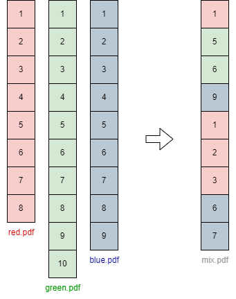

# PDFcomposer

A script that allows you to freely interleave and concatenate the pages (single pages or page ranges) 
of many PDFs into a new single PDF file. 

It can also be used to extract one or more subsets of pages from a single PDF file.

## how to run
```
python path/to/PDFcomposer.py
--fin <name1@path/to/file1.pdf> [<name2@path/to/file2.pdf> ... <nameN@path/to/fileN.pdf>] 
--fout path/to/output_file.pdf
--struct [name1,(pageA,pageB)]-[name2,pageC]-[name3,(pageD,pageE)]-[name2,(pageF,pageG)]
[--overwrite False]
```

## Arguments
<code>fin</code>: 
List of input file paths with their corresponding names, separated by the '@' character. 
The names can be assigned arbitrarily, they are only used to easily identify the files from which you want to 
take the pages that will make up the new PDF.

<code>fout</code>: 
Path where the produced PDF file is saved.

<code>struct</code>: 
The desired structure of the new PDF file.
Pages are taken from the input files in the order in which the blocks are specified.
When ranges are specified, all pages between the two extremes (included) are taken from the input file.

<code>overwrite</code>: 
Specify this argument and set it to True if you want to allow the generated output file to overwrite an existing file 
found in the same output path.

## Example
```
python PDFcomposer.py \
--fin \
R@./examples/red.pdf 
B@./examples/blue.pdf \
G@./examples/green.pdf \
--fout ./examples/mix.pdf \
--struct [R,1]-[G,(5,6)]-[B,9]-[R,(1,3)]-[B,(6,7)] \
--overwrite True
```


